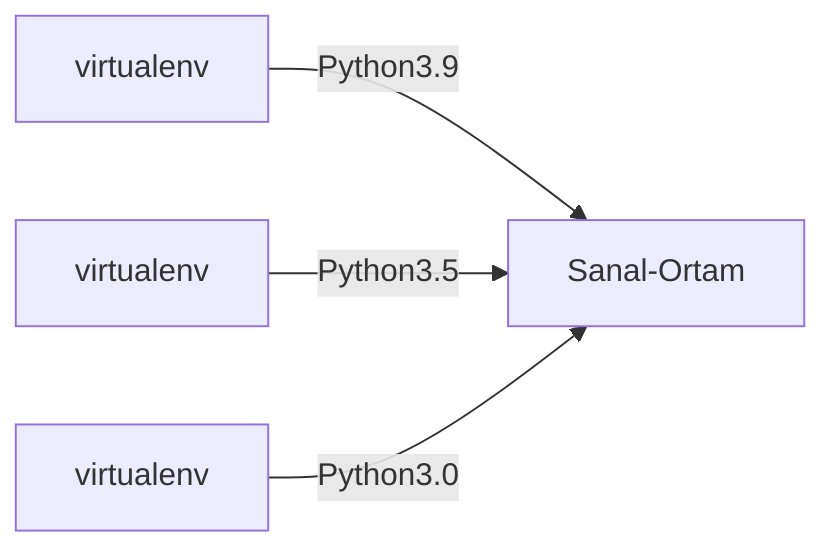

# Work

- [JavaScript](#JavaScript)
  - [NVM](#nvm) 
- [Python 1](#Python-1)
  - [virtualenv](#virtualenv)
  - [pyenv](#pyenv) 
- [Python 2](#Python-2)

## JavaScript

## nvm

<p>JavaScript'in farklı versiyonlarını kullanmak için kullanılır.</p>

<h5>Kurulum:</h5>

<ul>
  <li>Windows: <a href="https://github.com/coreybutler/nvm-windows/releases">nvm-windows</a></li>
  <li>Linux: <code>curl -o- https://raw.githubusercontent.com/nvm-sh/nvm/v0.40.2/install.sh | bash</code> </li>
</ul>

<p>Kurulumdan sonra Terminal(Shell)'i yeniden başlatın. Linux için: <code>exec "$SHELL"</code></p>
<p>Sürümü kontrol edin: <code>nvm --version</code></p>

<h5>Kullanım</h5>

<ul>
  <li><code>nvm install {sürüm} </code> Belirlenen sürümü indirmenizi olanak tanır. Örnek: <code>nvm install 8.0.0</code></li>
  <li><code>nvm use {sürüm} </code> Belirlenen sürümü kullanır.</li>
  <li><code>nvm run {sürüm} app.js </code> 'app.js'yi belirlenen sürüm ile çalıştırır.</li>
</ul>

## Python-1

## virtualenv

<p>Python'un farklı sürümlerini kullanarak sanal bir çalıştırma ortamı oluşturur. Böylece ana cihaza yüklemeye gerek kalmaz.</p>




<h5>Kurulum:</h5>

<ul>
  <li>Windows: <code>pip install virtualenv</code></li>
  <li>Linux: <code>sudo apt install python3-virtualenv </code> ya da <code>pip install virtualenv</code></li>
</ul>

<h5>Kullanım</h5>

NOT: Windows kullanıyorsanız <a href="https://apps.microsoft.com/detail/9n0dx20hk701?hl=tr-TR&gl=TR">Terminal</a> ya da <a href="https://apps.microsoft.com/detail/xp9khm4bk9fz7q?hl=tr-TR&gl=TR">Visual Studio Code</a> üzerinden çalıştırın.

<ul>
  <li><code>virtualenv {ortam adı} </code> Belirlenen ortam adı ile sanal çalışma dizini oluşturur. Örnek: <code>virtualenv ornekOrtam</code></li>
  <li>Sanal Ortam dizinine gidin: <code>cd {ortam-adı} </code> Sanal Ortamı Çalıştırma: <code>source bin/activate</code> Eğer Windows ise: <code>source {ornekOrtam}/Scripts/activate.bat</code></li>
  <li>Çalışma alanında çıkış yapmak için: <code>deactivate</code></li>
</ul>

## pyenv

<p>Tıpkı nvm gibi, pyenv'de Python'un farklı sürümlerini kullanmanıza olanak tanıyor.</p>

<h5>Kurulum</h5>

<b>Windows</b>

Windows için destek yok. Onun yerine WSL(Windows-Subsystem-Linux) ile, Linux yerinden kurabilirsiniz.

Linux:

<code>curl -fsSL https://pyenv.run | bash</code>

İndirmeti yaptıktan sonra ```~/.bashrc``` dosyasının en son satırına gidip, aşağıdaki kodları ekleyin:

```bash
export PATH="$HOME/.pyenv/bin:$PATH"
eval "$(pyenv init --path)"
eval "$(pyenv init -)"
eval "$(pyenv virtualenv-init -)"
```


